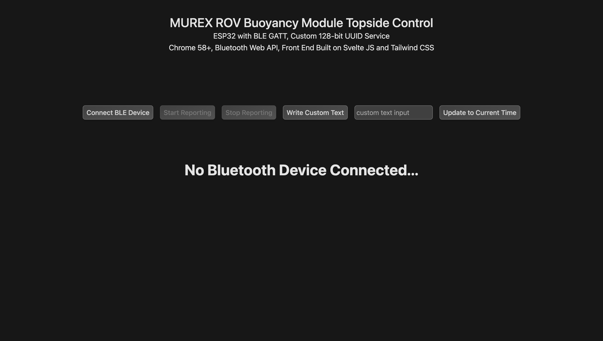

# Buoyancy Module Code

## Expected Behavior

After uploading the `.ino` to the ESP32, the ESP32 will begin advertising over Bluetooth. With a supported browser, launch the `FrontEnd` with `npm run dev`. A random time and the team number will show. Press `Start Reporting`, then press `Update to Current Time` to synchronize the ESP32 onboard RTC with the topside computer's RTC. **All of this can be run offline**

## Codebase Overview

`BLEGatt.ino` is the file to be run on the ESP32. The ESP32 becomes a BLE Server, hosting a BLE GATT characteristic with READ, NOTIFY and WRITE properties. Power consumption of the ESP32 should be at around `0.25 Wh`.

`FrontEnd` is the SvelteKit project to be run on topside. Run `npm run dev` from within `./FrontEnd`. Connect to the ESP32 with the `Connect BLE Device` button. When the `Start Reporting` button is pressed, it will continuously stream data from the ESP32 at ~1hz using the Web Bluetooth API (Chrome 50+ recommended, Safari/Firefox do not work. Edge may work).

Note: To synchronize the time of the ESP32 with the computer, press `Update to Current Time`. Custom UTF-8 encoded text via text input and pressing `Write Custom Text` can also be sent but is not processed.

## Debugging

nRF Connect iOS/Android App offers many debugging capabilities. Use the UTF-8 encoding.

## Troubleshooting

- The device name on the ESP32 must match the scanning filter in the JavaScript. By default, it is called `ESP32 Byran`
- If the ESP32 cannot be found, press the reset button on the board
- Make sure the ESP32 is continuously receiving power.

## TODO

- [x] Enable manual resynchronization of UTC time via WRITE property on ESP32
- [x] Document code
- [x] Better UI and stream data directy to browser DOM
- [ ] Broadcasting, allow for multiple connections
